# Digital Pet — In-Class Activity 07

A Flutter pet-care app where taps and time change a pet's state. It uses `StatefulWidget`, `setState()`, timers that start in `initState()` and stop in `dispose()`, and mood feedback that doesn't rely on color alone.

- **Repository:** https://github.com/PrestonParis/Preston-nick-mad-pet
- **APK:** `DigitalPet_MadTeam.apk` (submitted separately to iCollege)

## Team

| Member | Workstream | Role | Pathway | Contribution (issues / PRs) |
|---|---|---|---|---|
| Preston Paris | Care Systems | Coordinator, state owner | Undergraduate | Care loop, timers, outcomes, rule/widget tests ([PRs](https://github.com/PrestonParis/Preston-nick-mad-pet/pulls?q=is%3Apr)) |
| Nick Gilreath | Pet Personality | UI owner, quality reviewer | Undergraduate | Pet personality work and cross-review ([PRs](https://github.com/PrestonParis/Preston-nick-mad-pet/pulls?q=is%3Apr)) |

- **Care Systems:** feed/play/reset, bounded meters, hunger and win timers, outcomes, state tests.
- **Pet Personality:** derived messages, mood feedback, pet asset, motion/accessibility polish, interaction tests.

## Setup, run, test, build

```bash
flutter pub get
flutter run
flutter analyze
flutter test
flutter build apk --release   # build/app/outputs/flutter-apk/app-release.apk
```

## Project structure

| File | Responsibility |
|---|---|
| `lib/pet_model.dart` | Pure-Dart game rules: `PetState`, `PetRules` (feed, play, hunger tick, win, reset, rename), clamping, mood bands, and the derived `petMessage`. Contains no widgets. |
| `lib/main.dart` | `HomeScreen` and `PetScreen`. The pet screen's `State` holds the current `PetState`, owns the timers and text controller, and renders the UI. |
| `test/pet_model_test.dart` | Unit tests for boundaries, mood thresholds, overflow ticks, outcomes, and reset. |
| `test/pet_screen_test.dart` | Widget tests that run the real timers with short durations: hunger ticks, pause, win, win cancellation, loss, reset, renaming, and disposal. |

`PetScreen` takes `hungerInterval` (default 30 s) and `winDuration` (default 3 min) as immutable constructor parameters. Tests pass short values, and the app always uses the production defaults, so nothing needs to be changed back before a release build.

## Game rules

| Event | Effect |
|---|---|
| Start / Reset | Happiness 50, hunger 50, outcome cleared, name kept, win timer cancelled, exactly one hunger timer restarted. |
| Feed | Hunger −10. If the resulting hunger is below 30 (overfed), happiness −20; otherwise happiness +10. |
| Play | Happiness +10, hunger +5. |
| Hunger tick (every 30 s) | Hunger +5. If a tick would push hunger past 100, hunger is clamped to 100 and happiness drops by 20. Going from 95 to 100 has no penalty. |
| Tap pet | Bounce and ❤️ only. Happiness doesn't change, so tapping can't make the win trivial. |
| Win | Happiness stays **strictly above 80** for 3 continuous minutes. The timer starts on the first crossing above 80 and is cancelled as soon as happiness drops to 80 or below. |
| Loss | Hunger is 100 and happiness is 10 or lower. |
| After win/loss | Feed, Play, and Pause are disabled and both timers stop until Reset. |

All meters are clamped to 0–100 in `PetState.copyWith`.

**Mood bands** (these drive the label, icon, tint, and scale): above 70 is Happy (green, 1.06×), 30–70 is Neutral (yellow, 1.0×), below 30 is Unhappy (red, 0.94×).

## Advanced features (undergraduate: 2)

| Feature | User flow | State changes and why | Learning outcome | Evidence |
|---|---|---|---|---|
| **Session controls** (Pause/Resume) | Tap Pause: Feed and Play are disabled and the pet says "Zzz... (paused)". Tap Resume to continue. | `_paused` is set inside `setState`. Pausing cancels the hunger timer and the win timer. Resuming starts a new hunger timer (cancelling any old one first) and, if happiness is still above 80, starts a fresh 3-minute win streak, because a paused streak isn't continuous. | Timer lifecycle; one source of truth | Widget test `pause stops the hunger timer…`; device matrix below |
| **Visual polish & accessible motion** | Feed, Play, or tap the pet to see the bounce and emoji. Meters glide, and the speech bubble cross-fades. | Action bounce (`AnimatedScale` plus a replaceable timer). Action reactions 🍖🎾❤️ (`AnimatedSlide` + `AnimatedOpacity`). Living meters (`TweenAnimationBuilder`). Expression switch (`AnimatedSwitcher` keyed on the message). Mood tint and size. Reduced motion: `MediaQuery.disableAnimations` sets every duration to zero and turns off the bounce. Only short-lived animation flags are stored. Mood, color, scale, and message are all derived from `PetState`. | UI derived from state; delayed callbacks respect the lifecycle | Threshold unit test (29/30/70/71); device matrix and reduced-motion comparison below |

## Test evidence

### Automated (`flutter test`)

```
00:00 +20: All tests passed!
```

### Device test matrix

Release build (`DigitalPet_MadTeam.apk`) installed on an Android emulator (Pixel profile), October 5, 2026. Times are the host clock. Values were read through the app's accessibility labels.

| Scenario | Expected | Result |
|---|---|---|
| Feed at hunger 5 | Hunger clamps to 0; overfed rule applies | Hunger 5 → 0, happiness 10 → 0 ✅ |
| Feed at hunger 95 | Hunger 85; happiness +10 | Hunger 95 → 85, happiness stayed 100 (clamped) ✅ |
| Play at happiness 100 | Happiness stays at 100 | 100 → 100, hunger 65 → 70 ✅ |
| Happiness 29 / 30 / 70 / 71 | Unhappy-red / Neutral-yellow / Neutral-yellow / Happy-green, text label always shown | Actions change happiness in steps of 10, so 29 and 71 can't be reached in play; they're covered by the unit test. On device: 30 Neutral yellow, 70 Neutral yellow, 80 Happy green, 10 Unhappy red ✅ (screenshots below) |
| Exactly 80 | Happy, but no win streak | 80 showed "Keep happiness above 80…" with no streak ✅ |
| Above 80 for 2:55, then drop to 80 | No win; streak cleared | Streak 22:20:57 → dropped to 80 at 22:23:52; no win by 22:24:35 ✅ |
| Above 80 again for 3:00 | Win; hunger timer stops | Streak started 22:24:45, "You win!" by 22:27:55; hunger stayed 70 through 22:29:03; Feed, Play and Pause disabled ✅ |
| Hunger 95 → 100 → next tick | No penalty, then happiness −20 | 22:35:30 hunger 95 / happiness 50 → 22:36:00 100 / 50 → 22:36:30 100 / 30 ✅ |
| Hunger 100 and happiness 10 | Game over; values frozen until Reset | 22:37:00 game over at 100 / 10; unchanged at 22:38:05; only Reset enabled ✅ |
| Pause / Resume | No ticks while paused; care actions disabled | Hunger stayed 65 from 22:31:15 to 22:32:25; Feed and Play disabled; resumed 22:32:30, next tick 65 → 70 by 22:33:03 ✅ |
| Rename | Name appears in title and speech | "Mochi" shown in app bar and "Hi, I'm Mochi!" ✅ |
| Leave the pet screen with the timer running | Timers cancelled, no errors | Pressed Back with hunger and win timers running and waited 65 s; logcat showed no Flutter errors or exceptions ✅ |
| Reduced motion on / off | No bounce or slide when on; values still update | Frame captured right after Play: with motion on, pet mid-bounce, 🎾 fading in, bar mid-glide; with Android "Remove animations" on, final state immediately ✅ |
| Release APK smoke test | Installs, launches, core actions work | `adb install` succeeded; app launched; feed, play, pause, reset, rename all worked ✅ |

## Collaboration evidence

- Issues: https://github.com/PrestonParis/Preston-nick-mad-pet/issues?q=is%3Aissue
- Pull requests (Care Systems by Preston, reviewed by Nick; Pet Personality by Nick, reviewed by Preston): https://github.com/PrestonParis/Preston-nick-mad-pet/pulls?q=is%3Apr

## Screenshots

Captured from the release APK on the Android emulator during the tests above.

| Home | Neutral (50) | Neutral (30) | Neutral (70) |
|---|---|---|---|
| 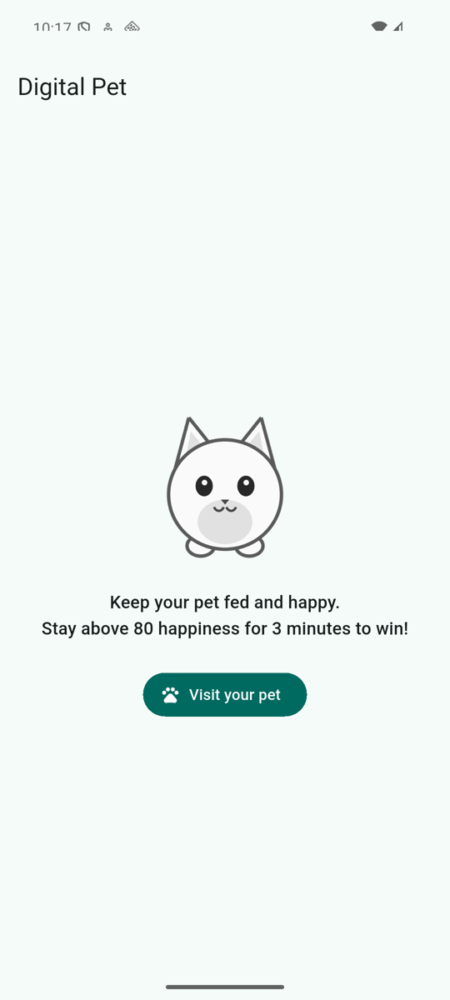 | 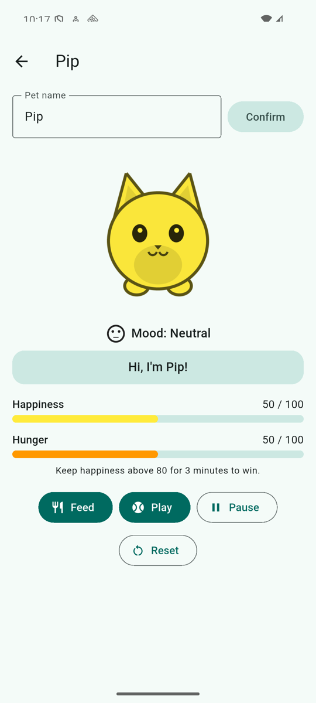 | 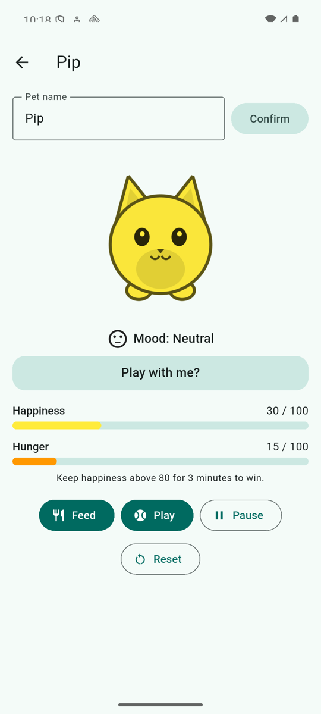 | 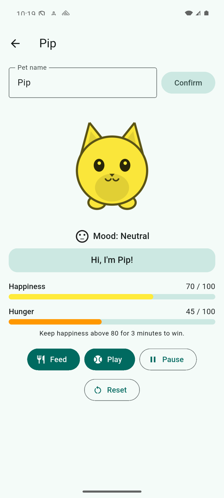 |

| Happy (80, no streak) | Happy (100, streak running) | Unhappy (10) | Pet named "Mochi" |
|---|---|---|---|
| 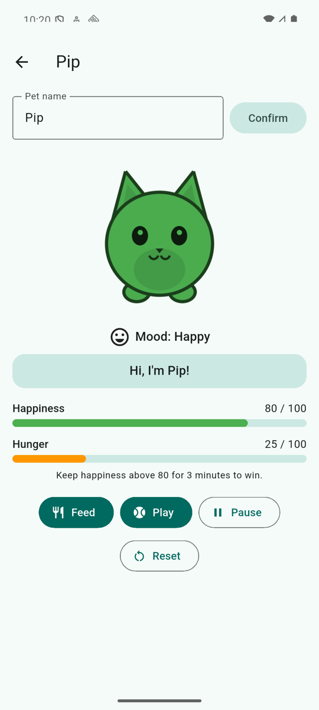 | 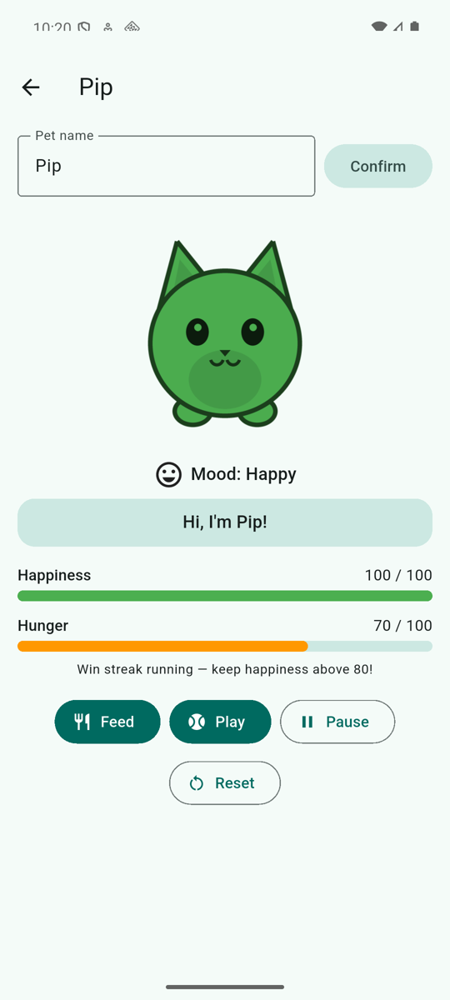 | 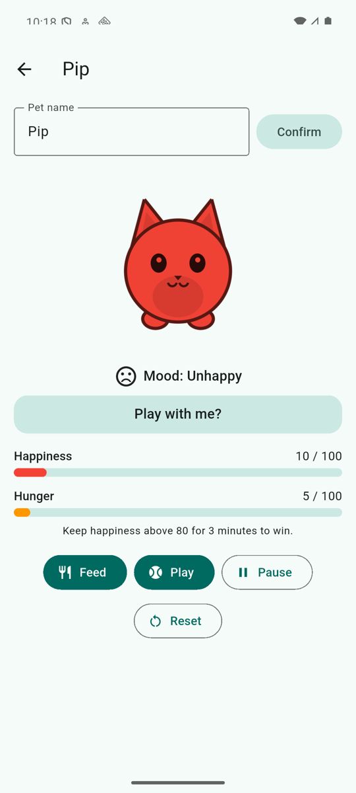 | 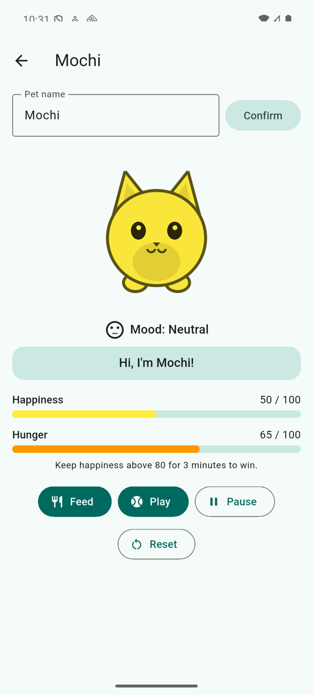 |

| Win | Game over |
|---|---|
| 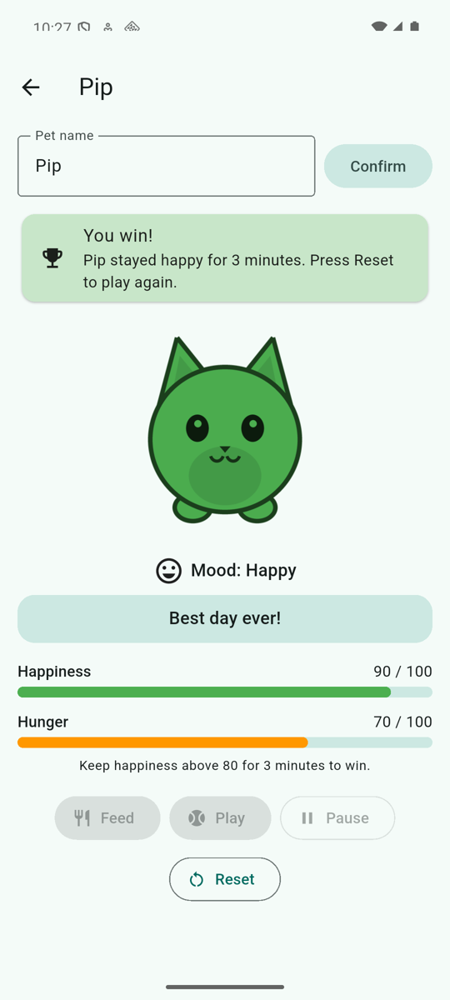 | 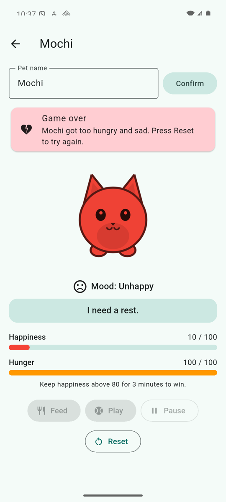 |

Reduced motion, frame right after tapping Play (left: animations on; right: "Remove animations" on):

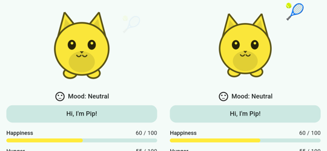

## Asset license

`assets/pet.png` is an original drawing made for this project (drawn with a Python/Pillow script; no third-party artwork) and is free to use in this repository. It is a light grayscale image so that `BlendMode.modulate` tints it clearly.
